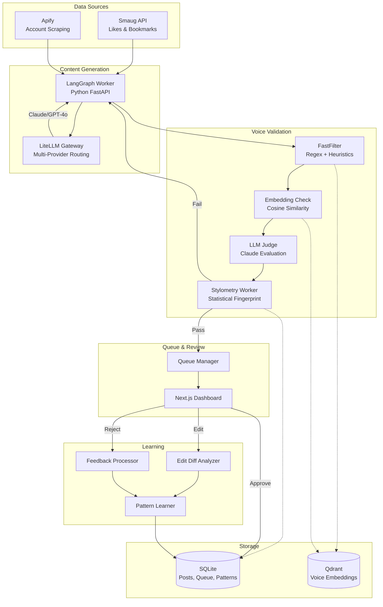

# ai-social-engine

**Autonomous AI content engine for Twitter/X.** Multi-agent architecture with voice matching, slop detection, pattern learning, and cost-optimized LLM routing.

[](https://www.typescriptlang.org/)
[](https://nextjs.org/)
[](https://langchain-ai.github.io/langgraph/)
[](https://github.com/BerriAI/litellm)
[](https://qdrant.tech/)
[](https://www.docker.com/)
[](LICENSE)

> `296 TypeScript files` | `56 API endpoints` | `8 subsystems` | `4-layer voice validation`

---

## What It Does

ai-social-engine generates Twitter/X content that sounds like **you**, not like a bot. It learns your writing style from examples, validates every draft against your voice profile, catches AI-sounding phrases, and maintains a human-in-the-loop review queue.

**The pipeline:**

```
Source Material → Ideation → Drafting → Voice Check → Slop Detection → Refinement → Queue → Review → Publish
```

**What makes it different:**
- **4-layer voice validation** ensures every post matches your writing style
- **Slop detection** catches and eliminates AI-generated phrases ("Let's dive in", "Game-changer", etc.)
- **Pattern learning** improves over time from your edits and feedback
- **Cost-optimized routing** picks the cheapest model that meets quality requirements
- **Circuit breaker** prevents cascading failures across LLM providers

---

## Features

### Content Generation Pipeline

Multi-stage pipeline powered by LangGraph with up to 3 rewrite cycles:

```
Analyze Source → Select Formula → Generate Draft → Voice Check → Slop Check
                                                          ↓
                                              [Critique → Rewrite] × 3
                                                          ↓
                                                      Finalize
```

- **Source analysis** — Extracts key insights from curated Twitter accounts
- **Formula selection** — Picks the best content format (insight, analogy, contrarian, etc.)
- **Multi-cycle refinement** — Iterates up to 3x if voice/slop checks fail
- **State checkpointing** — Full debugging with LangGraph state persistence

### 4-Layer Voice Validation

Every generated post passes through 4 validation layers:

| Layer | Method | Speed | Purpose |
|-------|--------|-------|---------|
| **FastFilter** | Regex + heuristics | <5ms | Catch obvious AI patterns |
| **Embedding** | Cosine similarity | ~50ms | Compare against approved posts |
| **LLM Judge** | Claude evaluation | ~2s | Nuanced voice consistency |
| **Stylometry** | Statistical analysis | ~100ms | Sentence length, vocabulary, punctuation fingerprint |

Posts must pass all 4 layers or get rejected back to the rewrite cycle.

### Pattern Learning & Memory

The system learns from every interaction:

```
User Feedback → Pattern Extraction → Conflict Resolution → Weighted Memory
     ↑                                                           ↓
     └──────────── Decay (older patterns fade) ←────────────────┘
```

- **Edit diff analysis** — Learns what you change and why
- **Approval/rejection signals** — Reinforces good patterns, suppresses bad ones
- **Pattern weighting** — Recent patterns have more influence
- **Automatic decay** — Old patterns fade unless reinforced

### Queue Management

```
Generate → Review Queue → [Approve / Edit / Reject] → Learning Loop
```

- **Keyboard-first UI** — `J`/`K` navigation, `A`pprove, `R`eject, `E`dit
- **Inline editing** — Modify posts directly, changes feed back to learning
- **Batch operations** — Process multiple posts efficiently
- **Rejection reasons** — Categorized rejection data for pattern improvement

### LLM Router with Circuit Breaker

Cost-optimized model selection with automatic failover:

```
Request → Budget Check → Model Selection → Circuit Breaker → Provider → Response
                              ↓                    ↓
                    [Fast: Haiku/GPT-4o-mini]   [Open → Half-Open → Closed]
                    [Quality: Sonnet/GPT-4o]
                    [Max: Opus]
```

- **Task-based routing** — Classification tasks use cheap models, generation uses quality models
- **Budget enforcement** — Daily/monthly limits per provider, operations halt when exceeded
- **Circuit breaker** — 3 states (Closed/Open/Half-Open) per provider
- **Automatic fallback** — Claude fails? Tries GPT-4o. Both down? Graceful degradation.
- **Cost tracking** — Per-request cost logging with model attribution

### Slop Detection

AI-phrase elimination system with 120+ banned patterns:

- **Phrase blacklist** — "Let's dive in", "Game-changer", "Deep dive", etc.
- **Structural analysis** — Catches AI-typical sentence patterns
- **Voice contrast** — Flags text that sounds too different from your voice
- **Auto-rewrite** — Attempts to fix sloppy phrases before rejecting

See [`config/slop-words.json`](config/slop-words.json) for the full list.

### Cost Tracking Middleware

Every LLM call is tracked and budgeted:

- Per-request cost calculation (input/output tokens × model pricing)
- Daily and monthly budget enforcement per provider
- Operations halt automatically when budget exceeded
- Dashboard with real-time cost visibility

---

## Architecture



### Service Architecture

| Service | Technology | Port | Purpose |
|---------|-----------|------|---------|
| **Next.js App** | TypeScript/React | 3000 | Dashboard, API routes, queue management |
| **LiteLLM Gateway** | Python/FastAPI | 8001 | Multi-provider LLM routing with fallback |
| **LangGraph Worker** | Python/FastAPI | 8002 | Content generation pipeline with state |
| **Stylometry Worker** | Python/FastAPI | 8003 | Voice statistical analysis |
| **Qdrant** | Rust | 6333 | Vector similarity search for voice matching |
| **SQLite** | Embedded | — | Posts, queue, patterns, costs, accounts |

---

## Evolution Roadmap

### Phase 1: Human-in-the-Loop (Current)

```
Generate → Queue → Human Review → Approve/Edit/Reject → Learn → Repeat
```

- All posts require human approval before publishing
- Every edit and rejection feeds the learning system
- Voice profile calibrates from 20+ gold examples
- System improves with each review cycle

### Phase 2: Semi-Autonomous

```
Generate → Auto-Approve (high confidence) → Queue (low confidence) → Human Review
```

- Posts exceeding confidence threshold auto-approve
- Shadow mode: AI makes decisions, human verifies
- Engagement tracking validates AI decisions
- Gradual trust building with configurable thresholds

### Phase 3: Full Autonomy

```
Generate → Validate → Schedule → Publish → Track → Optimize
```

- Fully autonomous content loop
- Engagement-weighted learning
- Self-optimizing content strategy
- Human oversight via dashboards and alerts

---

## Quick Start

### Prerequisites

- Node.js 18+
- Docker & Docker Compose
- Anthropic API key ([get one here](https://console.anthropic.com/))

### 1. Clone & Install

```bash
git clone https://github.com/dtsatskin/ai-social-engine.git
cd ai-social-engine
npm install
```

### 2. Configure

```bash
cp .env.example .env.local
```

Edit `.env.local` with your API keys. At minimum, you need:
- `ANTHROPIC_API_KEY` — for content generation
- `APIFY_API_TOKEN` — for scraping source accounts (optional)

### 3. Start Services

```bash
# Start Qdrant + Python workers
docker compose up -d

# Initialize database
npm run db:init

# Start the app
npm run dev
```

### 4. Bootstrap Your Voice

1. Open `http://localhost:3000/config`
2. **Voice Guidelines** — Paste your writing rules (DO's, DON'Ts, examples)
3. **Gold Examples** — Add 20+ example posts that represent your voice
4. **Curated Accounts** — Add Twitter accounts you want to learn from
5. **API Keys** — Configure your Anthropic and optional OpenAI keys

### 5. Generate Content

1. Navigate to the Dashboard
2. Click "Generate" to create new posts
3. Review in the Queue — approve, edit, or reject
4. Your edits automatically improve future generations

---

## Voice Profile Configuration

Voice profiles control how the engine writes. Configure through the UI at `/config` or by editing files directly.

### Characteristics (0.0 - 1.0)

| Slider | Low | High |
|--------|-----|------|
| **Formality** | Casual, conversational | Professional, formal |
| **Confidence** | Hedging, uncertain | Assertive, declarative |
| **Humor** | Serious, straight | Witty, playful |
| **Complexity** | Simple, accessible | Technical, nuanced |
| **Directness** | Roundabout, gentle | Blunt, to-the-point |
| **Empathy** | Analytical, detached | Warm, understanding |

### Voice Guidelines Format

Create a markdown file with these sections:

```markdown
## Rules
- Never use hashtags
- Problem-first framing

## Do's
- Start with the pain point
- Use direct "you" address

## Don'ts
- "Let's dive in"
- "Game-changer"

## Examples
> Your best tweets go here. Add 20+ for best results.
```

See [`VOICE_GUIDELINES_TEMPLATE.md`](VOICE_GUIDELINES_TEMPLATE.md) for a complete template and [`config/voice-profiles/example.json`](config/voice-profiles/example.json) for a JSON example.

For a detailed guide, see [`docs/voice-profiles.md`](docs/voice-profiles.md).

---

## Tech Stack

| Layer | Technology |
|-------|-----------|
| **Frontend** | Next.js 14, React 18, Tailwind CSS |
| **Backend** | Next.js API Routes, TypeScript |
| **Database** | SQLite (better-sqlite3), Qdrant (vectors) |
| **LLM** | Anthropic Claude, OpenAI GPT-4o (fallback) |
| **Pipeline** | LangGraph (Python), LiteLLM (routing) |
| **Analysis** | Custom stylometry engine (Python) |
| **Scraping** | Apify, Smaug API |
| **Testing** | Vitest, Playwright |
| **Deployment** | Docker Compose |

---

## Documentation

- [`docs/architecture.md`](docs/architecture.md) — Detailed architecture with subsystem diagrams
- [`docs/voice-profiles.md`](docs/voice-profiles.md) — Guide to creating voice profiles
- [`docs/slop-detection.md`](docs/slop-detection.md) — How slop detection works
- [`docs/API.md`](docs/API.md) — API reference (56 endpoints)
- [`docs/DATABASE_SCHEMA.md`](docs/DATABASE_SCHEMA.md) — Database schema documentation
- [`docs/WORKERS_SETUP.md`](docs/WORKERS_SETUP.md) — Python worker setup guide

---

## Scripts

```bash
npm run dev                # Start development server
npm run build              # Production build
npm run test               # Run unit tests
npm run test:integration   # Run integration tests
npm run test:e2e           # Run Playwright E2E tests
npm run test:coverage      # Test coverage report
npm run typecheck          # TypeScript type checking
npm run db:init            # Initialize SQLite database
npm run health-check       # Verify all services are running
npm run validate:llm-config # Validate LLM routing configuration
```

---

## License

[MIT](LICENSE) - Dominik Tsatskin
