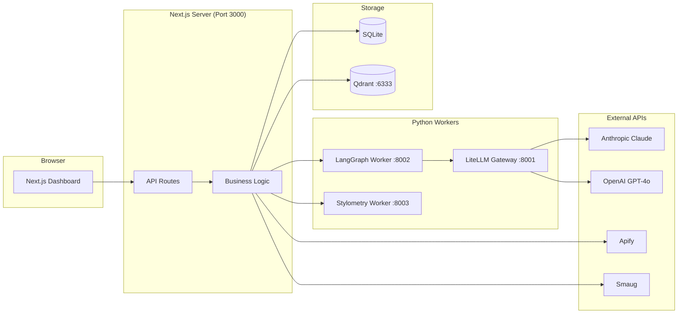
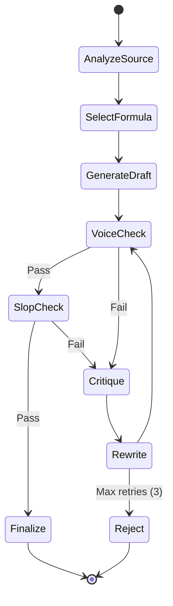
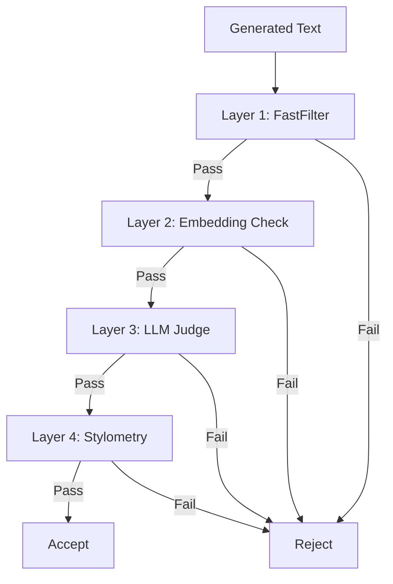
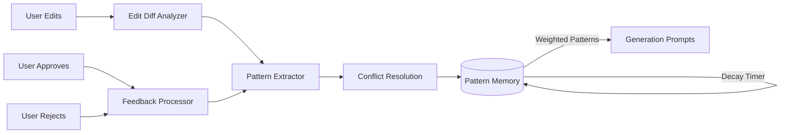
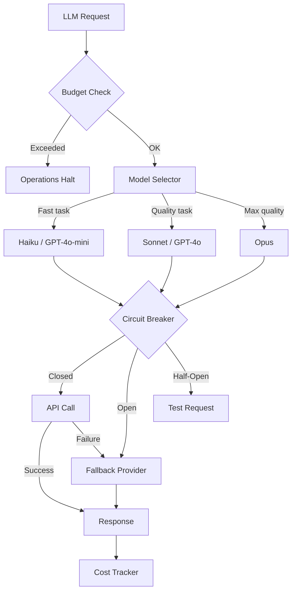
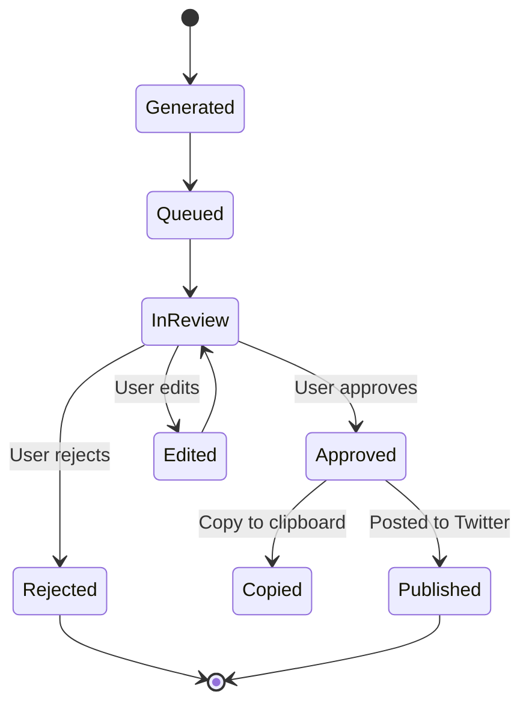
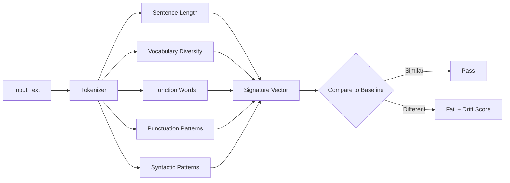

# Architecture

Detailed architecture documentation for ai-social-engine.

## System Overview

ai-social-engine is a multi-service architecture combining a Next.js application with Python sidecar workers, connected through REST APIs and shared vector/relational storage.



---

## Subsystem 1: Content Generation Pipeline

The generation pipeline is built on LangGraph, a Python library for building stateful, multi-step LLM workflows.



**Key components:**
- `workers/langgraph/graphs/content_generation.py` — Main generation graph
- `workers/langgraph/checkpointing.py` — State persistence for debugging
- `src/lib/generation/langgraph-client.ts` — TypeScript client for the Python worker
- `src/lib/generation/content-type-selector.ts` — Formula/content type selection

**State schema:**
```python
class GenerationState(TypedDict):
    source_text: str
    formula: str
    draft: str
    voice_score: float
    slop_issues: list[str]
    rewrite_count: int
    final_content: str | None
```

---

## Subsystem 2: Voice Validation Pipeline

4-layer progressive validation system. Each layer is more expensive but more accurate.



### Layer 1: FastFilter (~5ms)

Regex-based pattern matching against known AI phrases and structural patterns.

- `src/lib/voice/fast-filter.ts` — Fast heuristic checks
- `src/lib/slop/phrase-blacklist.ts` — 120+ banned AI phrases
- `src/lib/slop/structural.ts` — Structural pattern detection

### Layer 2: Embedding Similarity (~50ms)

Compares generated text embeddings against approved posts stored in Qdrant.

- `src/lib/voice/embeddings.ts` — Embedding generation and comparison
- `src/db/qdrant/collections.ts` — Qdrant collection management

### Layer 3: LLM Judge (~2s)

Claude evaluates voice consistency against your guidelines.

- `src/lib/anthropic/prompts/voice-evaluation.ts` — Evaluation prompt
- `src/lib/voice/confidence-scoring.ts` — Score aggregation

### Layer 4: Stylometry (~100ms)

Statistical fingerprint comparison: sentence length, vocabulary diversity, punctuation patterns, function word frequencies.

- `workers/stylometry/analyzer.py` — Python statistical analyzer
- `src/lib/voice/characteristics.ts` — Voice characteristic modeling
- `src/lib/voice/validation-pipeline.ts` — Pipeline orchestration

---

## Subsystem 3: Pattern Learning

Feedback-driven learning system that improves generation quality over time.



**Key components:**
- `src/lib/learning/edit-diff-analysis.ts` — Analyzes what users change in edits
- `src/lib/learning/clarification-rules.ts` — Extracts rules from feedback
- `src/lib/learning/feedback-processor.test.ts` — Feedback processing logic
- `src/lib/learning/stuck-detection.ts` — Detects when learning is stuck
- `src/db/models/feedback.ts` — Feedback persistence
- `src/db/migrations/003_create_patterns_table.ts` — Pattern schema
- `src/db/migrations/010_add_pattern_weighting.ts` — Weighted patterns

**Pattern lifecycle:**
1. **Extraction** — Patterns extracted from edits, approvals, rejections
2. **Weighting** — New patterns start at weight 1.0
3. **Reinforcement** — Repeated signals increase weight
4. **Decay** — Unused patterns decay toward 0
5. **Pruning** — Patterns below threshold are removed

---

## Subsystem 4: LLM Router & Circuit Breaker

Multi-provider LLM routing with cost optimization and fault tolerance.



**Key components:**
- `workers/litellm/server.py` — Python LiteLLM gateway
- `src/lib/llm/config.ts` — Model routing configuration
- `src/lib/costs/middleware.ts` — Cost tracking middleware
- `src/lib/costs/operations-halt.ts` — Budget enforcement
- `src/lib/anthropic/cost-tracking.ts` — Per-request cost logging
- `src/lib/resilience/` — Circuit breaker implementation

**Circuit breaker states:**
| State | Behavior |
|-------|----------|
| **Closed** | Normal operation, requests pass through |
| **Open** | All requests fail immediately (after N failures) |
| **Half-Open** | Allow one test request after timeout |

---

## Subsystem 5: Queue Management

Post lifecycle from generation to publication.



**Key components:**
- `src/db/models/queue.ts` — Queue data model
- `src/app/api/queue/route.ts` — Queue API
- `src/app/queue/page.tsx` — Queue UI with keyboard navigation
- `src/components/queue/` — Queue components

---

## Subsystem 6: Data Ingestion

Two data sources feed the generation pipeline:

### Smaug (Personal Feed)
- Fetches your Twitter likes and bookmarks
- Provides high-signal content you've already engaged with
- `src/lib/smaug/client.ts`

### Apify (Account Scraping)
- Scrapes tweets from curated accounts
- Tier-based frequency: Tier 1 (daily), Tier 2 (weekly)
- `src/lib/apify/client.ts`
- `src/db/models/accounts.ts`

---

## Subsystem 7: Notification System

Discord webhook notifications for system events.

- `src/lib/notifications/discord.ts` — Discord webhook client
- `src/lib/notifications/templates.ts` — Notification templates
- `src/lib/notifications/send.ts` — Send logic with verbosity levels

**Verbosity levels:**
| Level | Events |
|-------|--------|
| `minimal` | Budget exceeded, system errors |
| `summary` | Daily summaries, important events |
| `rich` | All events with full details |

---

## Subsystem 8: Stylometry Engine

Statistical voice fingerprinting using linguistic features.



**Features analyzed:**
- **Sentence length** — mean, standard deviation
- **Punctuation rates** — period, comma, exclamation, question, dash, ellipsis
- **Vocabulary diversity** — type-token ratio, hapax ratio
- **Function words** — frequency of "the", "and", "but", "of", "to", etc.
- **Syntactic patterns** — clause depth, words per clause, subordinate clause ratio

**Multi-language support:** English, German, Spanish, with auto-detection.

---

## Database Schema

### SQLite Tables

| Table | Purpose |
|-------|---------|
| `posts` | Generated and scraped posts with metadata |
| `queue` | Post review queue with status tracking |
| `feedback` | User approval/rejection/edit feedback |
| `patterns` | Learned patterns with weights and decay |
| `rules` | Clarification rules from feedback |
| `accounts` | Curated Twitter accounts for scraping |
| `formulas` | Content formulas/templates |
| `cost_tracking` | Per-request LLM cost logs |
| `sources` | Data source metadata |
| `app_settings` | Application configuration |
| `twitter_accounts` | Twitter API credentials (encrypted) |
| `scheduler_config` | Scheduling configuration |
| `post_performance` | Engagement tracking data |

### Qdrant Collections

| Collection | Purpose |
|-----------|---------|
| `voice_guidelines` | Voice guideline embeddings for similarity search |
| `approved_posts` | Approved post embeddings for voice comparison |

See [`docs/DATABASE_SCHEMA.md`](DATABASE_SCHEMA.md) for full schema details.

---

## Deployment

### Docker Compose (Recommended)

```bash
docker compose up -d
```

This starts:
- Qdrant vector database (port 6333)
- LiteLLM gateway (port 8001)
- LangGraph worker (port 8002)
- Stylometry worker (port 8003)

The Next.js app runs separately (`npm run dev` or `npm run build && npm start`).

### Service Dependencies

```
Next.js App
  ├── Qdrant (required for voice validation)
  ├── LangGraph Worker (required for generation)
  │   ├── LiteLLM Gateway (required for LLM calls)
  │   └── Qdrant
  └── Stylometry Worker (required for Layer 4 validation)
```
